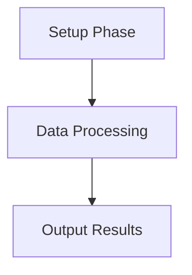

# Visio to Markdown Converter

A Python script to convert Microsoft Visio (.vsdx) files to Markdown with Mermaid diagrams.

## Features

- ✅ Extract text, shapes, and connections from Visio diagrams
- ✅ Generate Mermaid diagrams automatically
- ✅ Support for hierarchical shapes and sub-shapes
- ✅ Export to Markdown, JSON, or both
- ✅ Detect and track images in diagrams
- ✅ Extract metadata (title, creator, company)
- ✅ No AgentsAsAService dependencies - fully standalone

## Installation

### Prerequisites

- Python 3.7 or higher
- pip package manager

### Install Dependencies

```bash
pip install vsdx
```

## Usage

### Basic Usage

Convert a Visio file and display the markdown output:

```bash
python visio_to_markdown_standalone.py diagram.vsdx
```

### Save to File

Convert and save to a markdown file:

```bash
python visio_to_markdown_standalone.py diagram.vsdx --output diagram.md
```

### JSON Output

Convert to JSON format:

```bash
python visio_to_markdown_standalone.py diagram.vsdx --format json --output diagram.json
```

### Both Formats

Export both markdown and JSON:

```bash
python visio_to_markdown_standalone.py diagram.vsdx --format both --output diagram
# Creates: diagram.md and diagram.json
```

### Verbose Mode

Enable detailed logging:

```bash
python visio_to_markdown_standalone.py diagram.vsdx -v
```

## Command-Line Options

```
positional arguments:
  input_file            Path to the Visio (.vsdx) file

optional arguments:
  -h, --help            Show help message and exit
  -o, --output OUTPUT   Output file path (default: print to stdout)
  -f, --format {markdown,json,both}
                        Output format (default: markdown)
  -v, --verbose         Enable verbose logging
```

## Output Examples

### Markdown Output

The script generates markdown with:
- File metadata (title, creator, company)
- Page summaries
- Mermaid diagrams for visualizing shapes and connections
- Detailed shape information
- Connection mappings

Example:
```markdown
# MyDiagram.vsdx

## Metadata

- **Title**: System Architecture
- **Creator**: John Doe
- **Company**: Acme Corp

**Total Images Found**: 2

## Pages (1 total)

### Page 1: Main

#### Diagram



...
```

### JSON Output

Structured data with:
- Complete shape hierarchy
- All connections and relationships
- Metadata
- Image detection flags

## Python API

You can also use the converter as a Python module:

```python
from visio_to_markdown_standalone import VisioToMarkdownConverter

# Create converter
converter = VisioToMarkdownConverter(verbose=True)

# Convert to markdown
markdown = converter.convert('diagram.vsdx', output_format='markdown')

# Convert to JSON
json_data = converter.convert('diagram.vsdx', output_format='json')

# Get both
markdown, json_data = converter.convert('diagram.vsdx', output_format='both')

print(markdown)
```

## Supported Features

### Visio Elements Extracted

- ✅ Pages and page names
- ✅ Shapes with text content
- ✅ Shape types and masters
- ✅ Shape IDs and names
- ✅ Hierarchical sub-shapes (up to 5 levels deep)
- ✅ Connectors and relationships
- ✅ Embedded images (detection only)
- ✅ Document metadata

### Mermaid Diagram Generation

The tool automatically generates Mermaid diagrams that:
- Represent shapes as nodes
- Show explicit connections
- Infer hierarchical relationships for workflows
- Mark shapes containing images with 📷 icon

## Limitations

- Only `.vsdx` format is supported (modern Visio XML format)
- Legacy `.vsd` files are not supported
- Image analysis/OCR is not included (removed AI dependency)
- Complex shape formatting may not be fully preserved

## Troubleshooting

### "vsdx library not found"

Install the required library:
```bash
pip install vsdx
```

### "File not found"

Ensure the Visio file path is correct and the file exists:
```bash
ls -l your_file.vsdx
```

### Verbose logging for debugging

Use the `-v` flag to see detailed processing information:
```bash
python visio_to_markdown_standalone.py diagram.vsdx -v
```

## License

This is a standalone tool extracted from the AgentsAsAService platform for independent use.

## Contributing

To modify or extend the converter:

1. The main class is `VisioToMarkdownConverter`
2. Key methods:
   - `convert()` - Main conversion entry point
   - `_extract_page_data()` - Extracts data from each page
   - `_extract_shape_info()` - Recursively extracts shape information
   - `_generate_mermaid_diagram()` - Creates Mermaid diagrams
   - `_to_markdown()` - Formats output as markdown

## Examples

### Process Multiple Files

```bash
for file in *.vsdx; do
    python visio_to_markdown_standalone.py "$file" -o "${file%.vsdx}.md"
done
```

### Batch Conversion Script

```python
#!/usr/bin/env python3
from pathlib import Path
from visio_to_markdown_standalone import VisioToMarkdownConverter

converter = VisioToMarkdownConverter()

for vsdx_file in Path('.').glob('*.vsdx'):
    print(f"Converting {vsdx_file}...")
    markdown = converter.convert(str(vsdx_file), output_format='markdown')
    
    output_file = vsdx_file.with_suffix('.md')
    output_file.write_text(markdown, encoding='utf-8')
    print(f"Saved to {output_file}")
```
